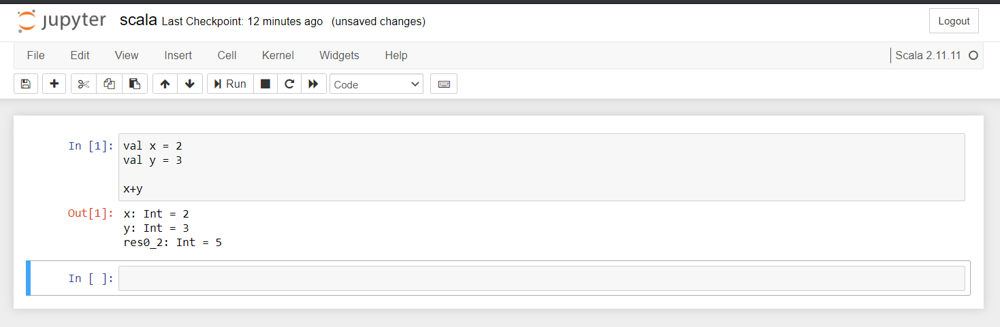

# Installation of scala programming language for Jupiter notebook on WSL2

In order to install the Scala kernel on a Windows machine you have to:

- Make sure you have java.exe in your path (in cmd you type "java -version" and returns your java version)

- Copy .coursier folder into %USERPROFILE% folder

- Copy scala folder into your jupyter's kernels folder. It could be: `~/.local/share/jupyter/kernels`

- Edit kernel.json that you have just copied (inside scala folder) changing the directory (line 8). As before, it could be: `~/.local/share/jupyter/kernels/scala/launcher.jar`

- Use this kernel from Jupyter notebook, running `jupyter notebook --no-browser` and selecting the "Scala" kernel.

> Note: If you encounter some error with the kernel you can debug jupyter notebook adding --debug: `jupyter notebook --debug`

Jupyter Scala kernel Source: https://github.com/alexarchambault/jupyter-scala